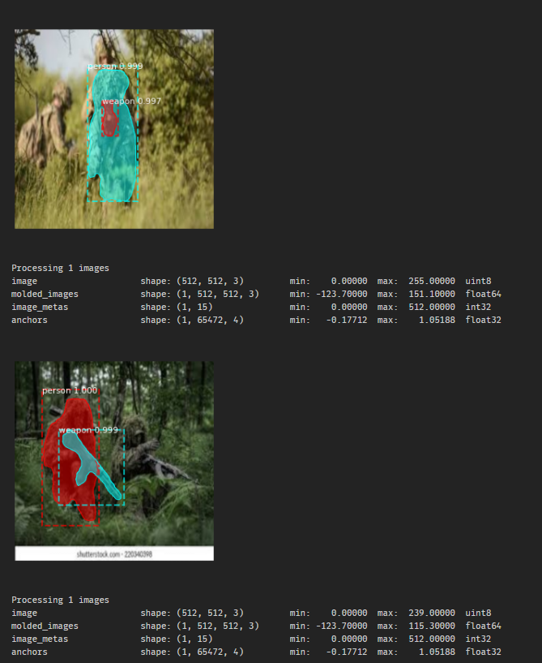

# AI-monitor-for-surveillance
### An AI-powered monitoring solution for defence surveillance.

### Team ID: SA5

### Team Members: 

- H Hemanth Kumar
- Fabian Christopher A
- Adityan B
- Jack Arockiason

### How To Run:

- Dataset/soldiers - contains our custom COCO dataset of training, testing and validation dataset images used.

- mrcnn folder - Contains the Original Mask RCNN Library 

- Run requirements.txt first

- Download our trained model from the link:
https://drive.google.com/uc?export=download&id=1g0hYm7wSPOm0IJSkWo8sOk4TKZPVTc1u

- Place this model file in the root directory 

- Run all cells in validation.ipynb 

### You can see that we have got high accuracy detection using Mask RCNN with very low training images.

### With More images to train and with video detection using opencv, we can use this model for continous surveillance and get much higher results than expected.

